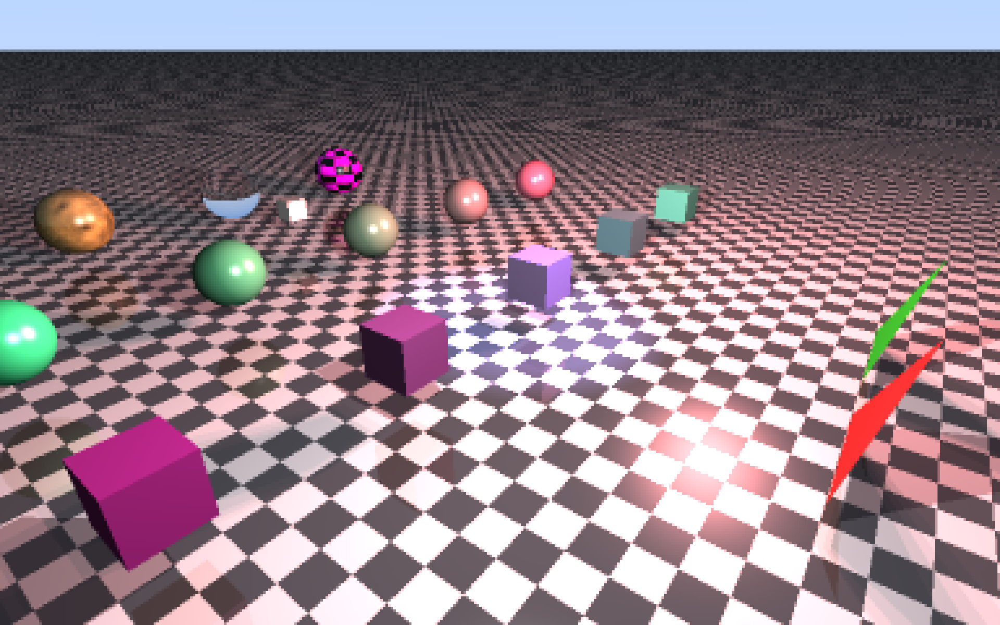
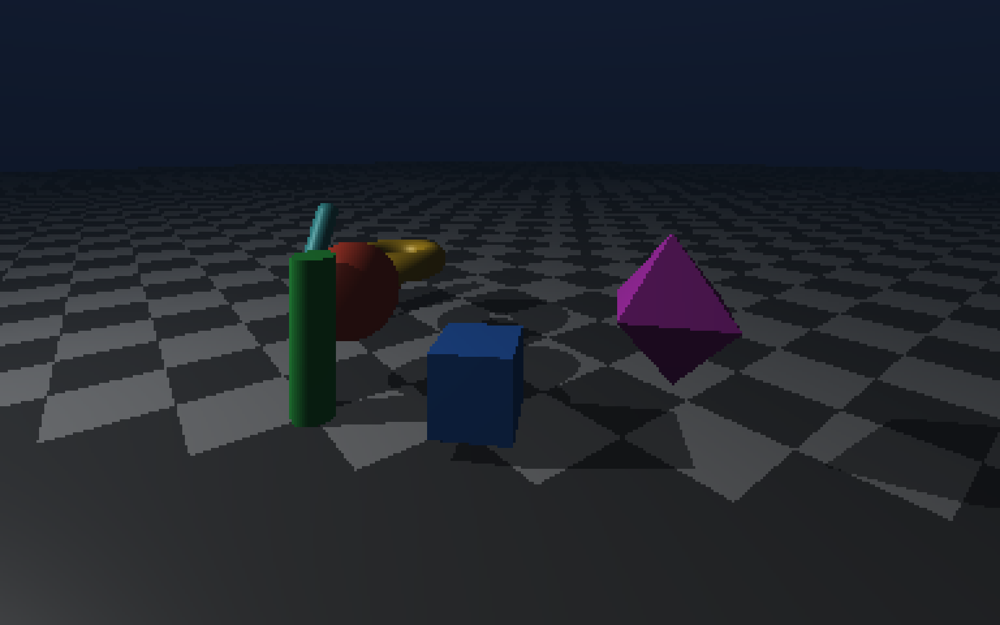
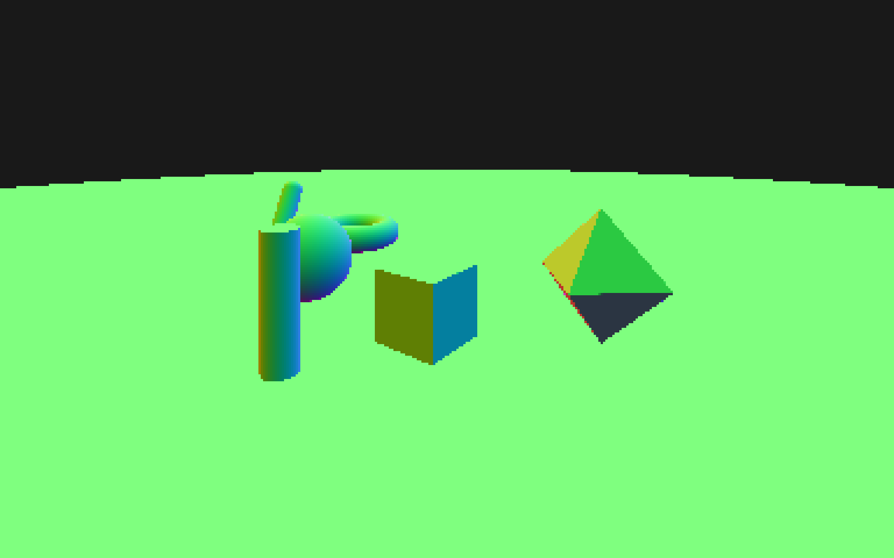
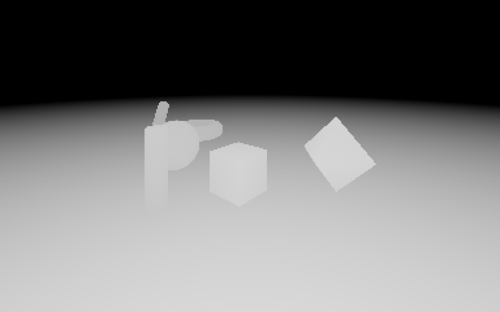
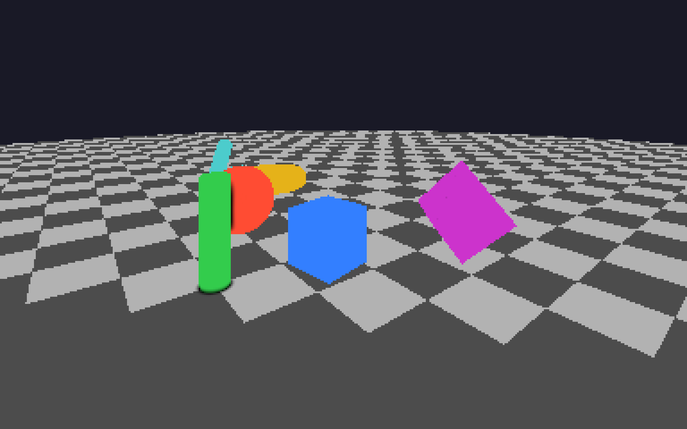
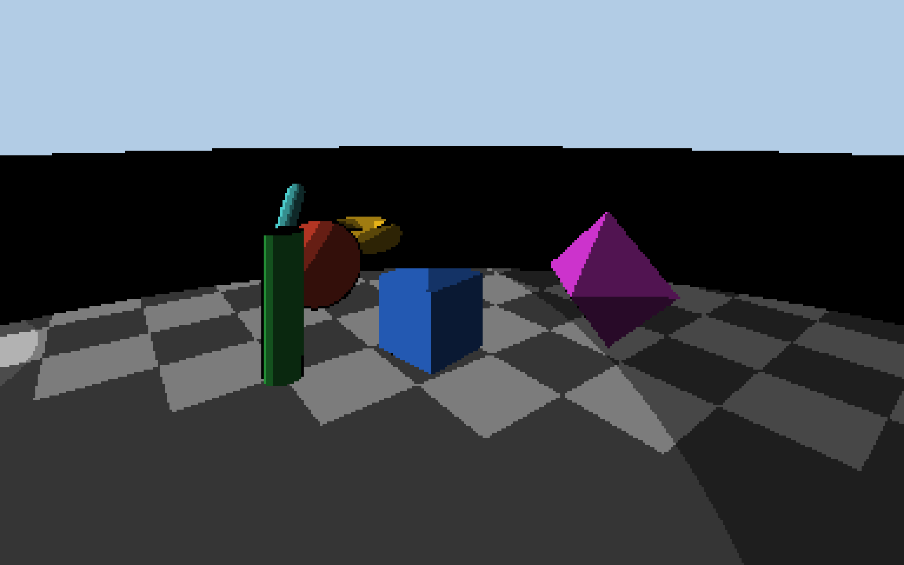
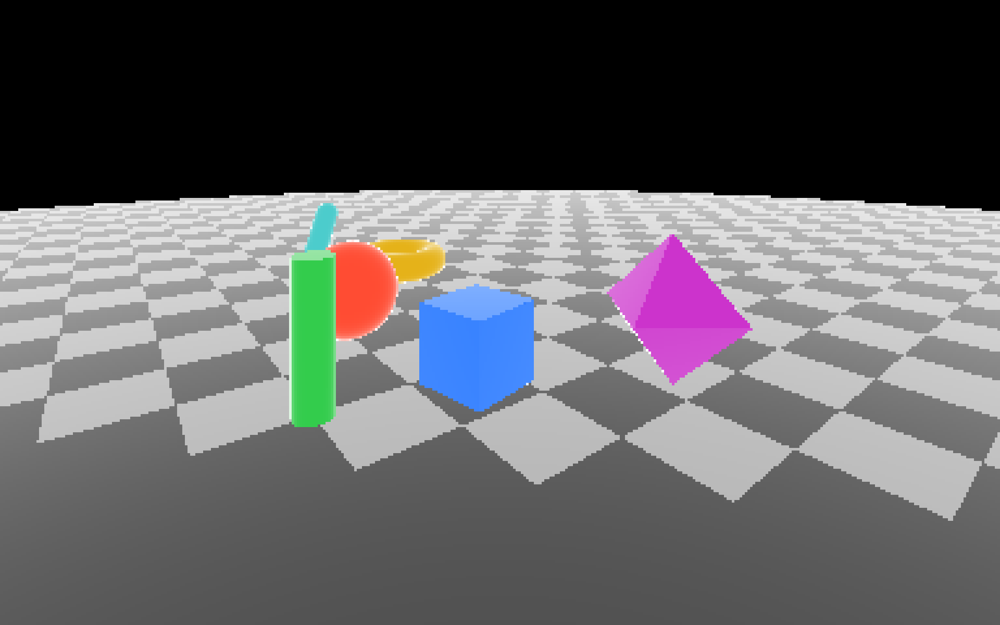
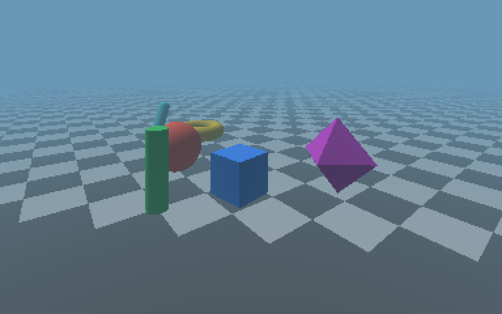
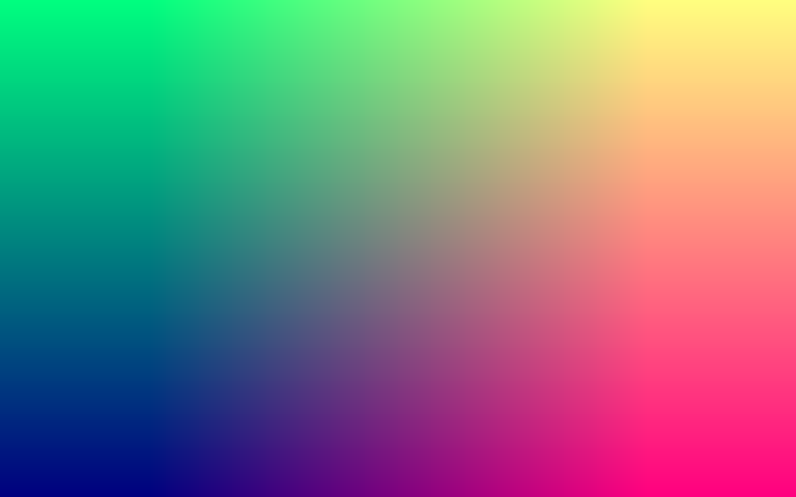
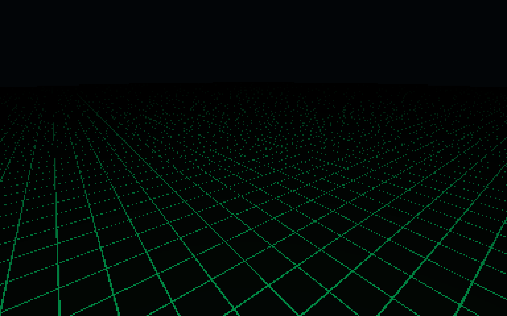

# SOFTWARE RAYTRACER v1.0

This is a high-performance software raytracing engine written in pure ANSI C. It supports accelerated meshes, procedural textures, and physically based refraction.

## SHADER PASSES (demo scenes)

| Mode | Description | Placeholder |
| :--- | :--- | :--- |
| Rasterizer | Basic raytracing with point/spot/area lights |  |
| SDF Raymarch | Sphere tracing using distance functions |  |
| Normals | Surface normal visualization |  |
| Depth | View space depth mapping |  |
| Ambient Occlusion | Localized contact shadowing |  |
| Cel Shading | Toon-style lighting quantization |  |
| Edge Detect | Sobel-based geometric outlines |  |
| Fog | Depth-based atmospheric scattering | |
| UV Debug | Texture coordinate visualization |  |
| Cool Grid | Grid Pattern |  |

## TECHNICAL INFORMATION

### RAYTRACING AND SDF RAYMARCHING
The engine utilizes two primary intersection methods. Standard raytracing solves quadratic and geometric equations for spheres and triangles. SDF raymarching uses distance functions to step along a ray until a surface is reached. This simulates how GPU fragment shaders handle complex procedural geometry.

### BVH ACCELERATION
For large meshes, the engine constructs a Bounding Volume Hierarchy (BVH). Instead of checking every triangle, it only tests boxes within the hierarchy. This allows for efficient rendering of complex models.

### POST-PROCESSING
Effects such as Edge Detection and Cel Shading are implemented as screen-space passes. The engine renders scene data to buffers first, then executes a second pass over every pixel to calculate derivatives or lighting steps. This mimics the multi-pass pipelines of modern graphics APIs.

### ANTI-ALIASING (SSAA)
Edges are smoothed using Super-Sampled Anti-Aliasing (SSAA). The engine renders at a higher internal resolution and then averages the samples down for the final output. This provides high-quality results at a higher performance cost.

## CONTROLS
```
[W,A,S,D]        : Lateral movement
[Q,E]            : Vertical movement
[ARROWS]         : Rotation
[SPACE]       : Toggle mouse camera movement
[TAB]         : Switch render passes
[X]           : Capture screenshot
[SHIFT]       : Sprint
```

## BUILDING AND RUNNING

A C compiler (GCC/Clang) and the Make utility are required. On Windows, MinGW is recommended for OpenGL and GDI headers. On Linux, ensure X11 development libraries are installed.

To build the project:

```bash
make clean
make -re
```

To run the application:

```bash
./main
```

### Dependencies

`libc` only. The [Tigr](https://github.com/erkkah/tigr/blob/master/tigr.h) library is already bundled inside :D

## API DOCS

### SCENE MANAGEMENT
```c
Scene* scene = createScene(camera, (Vec3){0.1f, 0.1f, 0.1f});
sceneBuildBVH(scene);
destroyScene(scene);
```

### ADDING OBJECTS
```c
sceneAddSphereSimple(scene, (Vec3){0,0,0}, 1.0f, (Vec3){1,0,0});
sceneAddBoxSimple(scene, (Vec3){5,0,0}, (Vec3){1,1,1}, (Vec3){0,1,0});
sceneAddLightSimple(scene, (Vec3){0,10,0}, (Vec3){1,1,1}, 1.0f);
sceneAddSpotLight(scene, pos, dir, 15.0f, 30.0f, color, 2.0f);
```

### TEXTURES AND MODELS
```c
loadObj("assets/model.obj", scene);
Tigr* tex = sceneLoadTexture(scene, "path/to.png");
Tigr* debug = sceneCreateDebugTexture(scene, 128, 128);
```

